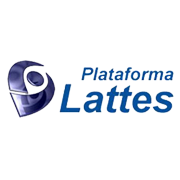

[Link to another page](./another-page.html).

## Sobre mim

Graduando em Matemática Computacional pela Universidade Federal de Minas Gerais (UFMG). Possui curso técnico em Informática pelo Sistema FIEMG, participação na Olimpíada do Conhecimento e atividades extracurriculares como Iniciação Científica e monitoria. Conhecimentos em programação em C, C++, R, Java e Desenvolvimento Mobile. Atualmente pesquisador júnior na ENACOM na célula de Otimização.


[](http://lattes.cnpq.br/0983117412894173) 
[)](https://www.linkedin.com/in/igor-lucas-a92550106)


```js
// Javascript code with syntax highlighting.
var fun = function lang(l) {
  dateformat.i18n = require('./lang/' + l)
  return true;
}
```

```ruby
# Ruby code with syntax highlighting
GitHubPages::Dependencies.gems.each do |gem, version|
  s.add_dependency(gem, "= #{version}")
end
```